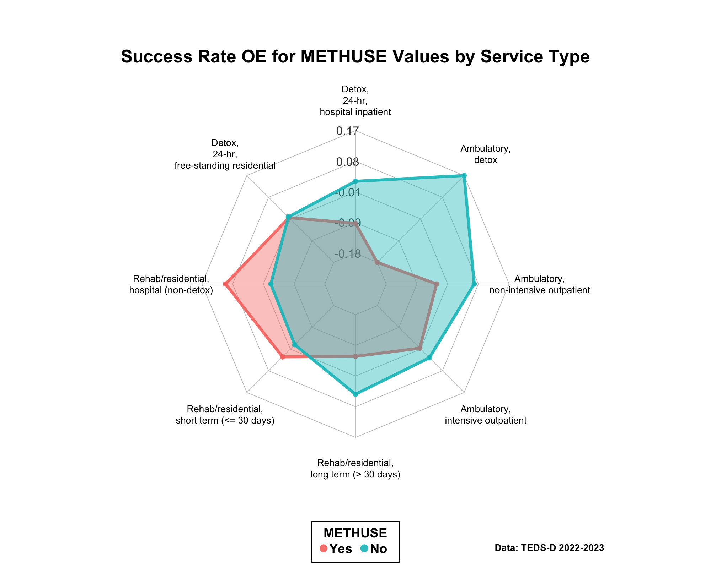
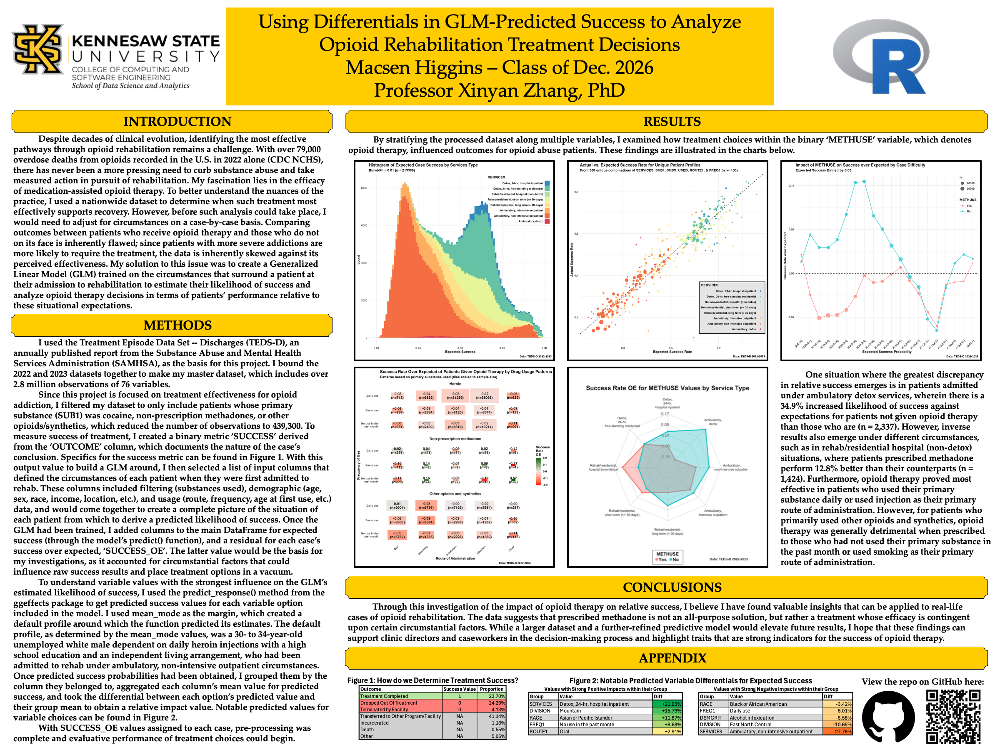

This article documents yet another example project made by an undergraduate student at KSU. 

### Finding a Dataset

At the beginning of the semester, the student approached their professor inquiring about the possibility of doing a research project in parallel with their classwork as a part of an honors contract. The professor referred the student to the Treatment Episode Data Set (TEDS), a nationwide yearly report on all recorded instances of formal treatment for substance abuse in the United States.

### Choosing a Question

When reading over the dataset, the student noticed a variable, `METHUSE`, which denoted whether the patient was given opioid therapy[footnote on definition here] or not. Seeing this flag, the student wondered how patients already struggling with addiction to opioids would fare in their outcome when given or not given opioid therapy. The dataset contained another variable, `REASON`, which denoted the final result of the patient's treatment, such as completing rehab, dropping out, or being kicked out. Using these variables, the student formulated their question:

> "Among patients in treatment for opioid addiction, does prescribing opioid therapy have a positive or negative impact on outcome?"

### Performing Exploratory Data Analysis

With a question in mind, the student moved onto the Exploratory Data Analysis (EDA) step of their project. To quantify the efficacy of opioid therapy, they created a binary variable `SUCCESS` as a logical filter of `REASON`. The table below demonstrates the assignment of `SUCCESS`:

| Outcome | Success Value | Proportion |
|:---|:---:|:---:|
| Treatment Completed | 1 | 23.70% |
| Dropped Out Of Treatment | 0 | 24.29% |
| Terminated by Facility | 0 | 4.13% |
| Transferred to Other Program/Facility | N/A | 41.14% |
| Incarcerated | N/A | 1.13% |
| Death | N/A | 0.55% |
| Other | N/A | 5.05% |

With the binary created, the student created a table of `SUCCESS` rates by `METHUSE` values, which resulted in the following table:

| METHUSE | SUCCESS_RATE |
|:---|:---:|
| Yes | 0.3647949 |
| No | 0.6043464 |

Although it was possible that opioid therapy was having a strong negative impact on patient outcomes, the student suspected that situational factors would lead to a strong correlation between patients having more difficult (less likely to be successful) cases and requiring opioid therapy. This hypothesis led the student to decide how they wanted to model their data.

### Modeling Data

To isolate for situation, the student chose to train a generalized linear model (GLM) on every opioid patient's situational factors upon their arrival to treatment, such as:

 * Filtering Factors (requirements to be in study, e.g. primary substance)
 * Demographic Factors (age, race, sex, etc.)
 * Drug Usage Factors (frequency/route of use, age at first use)
  
to estimate their likelihood of successful rehabilitation when they arrive at the institution. With each patient assigned a predicted success value, the residual of their actual vs. predicted success would provide, in the aggregate, a picture of what treatment decisions are better or worse for patients.

### Analyzing Results

With residuals calculated, the final step was to group patients and calculate their aggregate response to opioid therapy to see where the practice is most and least effective. One such visual derived from the analysis phase of this project is the radar plot below, which groups by the `SERVICES` setting the patient was in upon arrival.

{style="border: 2px solid black;"}

### Creating a Report

With multiple rounds of results analysis complete, the final step for the student was to compile their findings into a report. Since the student wanted to present their project at KSU analytics day at the end of the semester, they used a template from the analytics day website to structure their report in a poster board format. They condensed their background, methods, results, and conclusions into paragraph format and added their relevant visuals, and their project was done!

The full report has been attached below for future reference.

{style="border: 2px solid black;"}